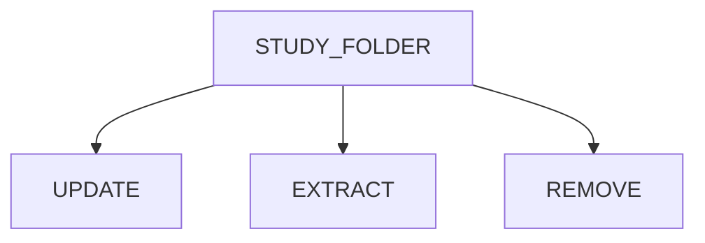

[](https://zenodo.org/doi/10.5281/zenodo.12806060)

# Varan-Release


# VARAN 2.0


## Introduction  

<p align="justify">
Varan is a Python-based application that provides a pipeline to automatically prepare cancer genomics data in the specific format supported by the <a href="https://www.cbioportal.org/">cBioPortal</a>.<br>
Specifically, starting with a folder containing the vcf files, or with a single file containing a list of vcf file paths, this application can structure and validate a study folder ready to be uploaded to its local instance of cBioPortal.<br>
This application also gives the possibility to work on existing study folder. In fact, it permits to update a study folder by adding new samples or extract/remove samples from it.<br>
Click <a href="https://github.com/bioinformatics-policlinicogemelli/Varan-Release/blob/main/cBioPortal%20docker%20install.md")>here</a> for more information on the steps for cBioportal installation.
 
## Installation procedure

### Prerequisites
* <b>Variant Effect Predictor (VEP)</b><p align="justify">The Variant Effect Predictor <a href="https://www.ensembl.org/info/docs/tools/vep/index.html">VEP</a> is a tool used to determine the effect of variants (SNPs, insertions, deletions, CNVs or structural variants) on genes, transcripts, and protein sequence, as well as regulatory regions. <br>The steps to install VEP can be found <a href="https://www.ensembl.org/info/docs/tools/vep/script/vep_download.html"> here</a>, while DB and FASTA files can be downloaded <a href="http://www.ensembl.org/info/docs/tools/vep/script/vep_cache.html#cache)"> here</a>

* <b>vcf2maf</b><br><p align="justify"><a href="https://github.com/mskcc/vcf2maf/tree/main">vcf2maf</a> is the tool required for the conversion of vcf files in maf format ones. 
<br>All the installation info can be found <a href="https://github.com/mskcc/vcf2maf/tree/main">here</a>

* <b>Samtools</b> <br><p align="justify"><a href="https://www.htslib.org/">Samtools</a> is a suite of programs for interacting with high-throughput sequencing data. 
<br>All the installation info can be found <a href="https://www.htslib.org/download/">here</a>

### Varan 2.0

To correctly install and use Varan 2.0:
1. Open a terminal
2. Digit the following command to clone the repository folder: 
```
git clone https://github.com/bioinformatics-policlinicogemelli/varan-2.0.git
```
3.  Install all of the packages required
```
cd <varan_folder_path>/varan-2.0
pip install -r requirements.txt
```
<p align="justify">
⚠️ <i>Depending on the python version it may be necessary to use pip3 instead of pip</i><br><br>
To test the installation and check if everything works, launch the main script <b>varan.py</b>: 

```
cd <varan_folder_path>/varan-2.0
python varan.py -h
```
If everything works, you will see a printed output like this:
```
1:04:09.32 | INFO | Welcome to VARAN usage: varan.py [-h] [-c CANCER] [-d] [-i INPUT] [-f] [-t {snv,cnv}] [-w] [-v] [-u] [-n NEWPATH] [-r] [-e] -o OUTPUT_FOLDER [-s SAMPLELIST] [-p PATH]
Argument of Varan script
optional arguments:
-h, --help show this help message and exit
-c CANCER, --Cancer CANCER Cancer Name
-i INPUT[INPUT ...], --input INPUT [INPUT ...]input folder/sample tsv (required) and patient tsv
-t {snv,cnv}, --analysis_type {snv,cnv,fus,tab} Select the analysis to follow [snv → snv analysis; cnv → cnv analysis; fus → fusions analysis; tab → table creation]
-w, --overWrite Overwrite output folder if it exists
-R, --resume Resume an already started analysis
-k, --oncoKB OncoKB annotation
-m, --multiple Multiple sample VCF
-f FILTER, --Filter FILTER Select filter for SNV [d → filter, p → filter==PASS, b → Benign, v → vaf, o → Oncokb, g → gnomAD, q → Consequence, y → polyphens, c → clin_sig, n → novel]
-u, --Update Add this argument if you want to concatenate two studies
-n NEWPATH, --NewPath NEWPATH Path of new study to add
-r, --Remove Add this argument if you want remove samples from a study
-e, --Extract Add this argument if you want to extract samples from a study
-o OUTPUT_FOLDER, --output_folder OUTPUT_FOLDER Output folder
-s SAMPLELIST, --SampleList SAMPLELIST Path of file with list of SampleIDs
-p PATH, --Path PATH Path of original study folder
-N NAME, --Name Name Add this argument if you want to give a custom name to the extract study
```
<p align="justify">
⚠️ <i>If any error is printed while launching varan.py, check if the step 3 completed without errors</i>

## Usage

<p align="justify">The first step to start using Varan is to correctly set the configuration file *conf.ini*. This file is divided in N subsessions:
<p align="justify">Paths: here is possible to specify Vep, vcf2maf and fasta paths,data and ClinVar path.
<p align="justify">Multiple: here is possible to specify the paths where the reference multi-VCFs(SNV,CNV,Combined_Output) are stored.
<p align="justify">OncoKB: here is possible to specify the personal key for annotation within the configuration settings of the annotation tool.
<p align="justify">Project: here is possible to specify project info like name, description and profile.
<p align="justify">Filters: here are specified the filters applied in the filtering step.
<p align="justify">Cna: here are specified the CNV genotypes and the ploidy.
<p align="justify">TMB: here are specified the TMB thresholds.
<p align="justify">MSI: here are specified the MSI thresholds.
<p align="justify">Fusion: here are specified the Fusion thresholds.
<p align="justify">Clinical Sample: here is possible to customize the name and type (example:string,number) of the columns in the data_clinical_sample.txt.
 <p align="justify">Clinical Patient: here is possible to customize the name and type (example:string,number) of the columns in the data_clinical_patient.txt.


<p align="justify">Varan application can be divided into two separate main blocks that require different inputs and ensure different operations to perform on them. The first block contains the functions to create a new study folder ex-novo, while the second one contains the functions to modify (Update/Extract/Remove samples) an existing study folder.To keep track of all operations performed by Varan,a versioning system is provided.

Here below are reported the steps and the options to set to run each block.

### Block One: Create Study ex-Novo

#### 1. Preparing Input

<p align="justify">
To create a new study folder, the user must give .vcf files as input to the program.Varan can handle two types of input: it can either process the entire folder directly or specific files (which must necessarily be in the correct folder)
Below, before specifically explaining how the tool works, are examples of standard templates that Varan takes as input.


Template_n1:Sample.tsv

⚠️ <i>For the proper functioning of Varan, the existence of this template is required.</i>

```
SampleID	PatientID	MSI	TMB	MSI_THR TMB_THR	ONCOTREE_CODE	snv_path	cnv_path	comb_path
SampleID	PatientID	MSI	TMB	MSI_THR TMB_THR	ONCOTREE_CODE	snv_path	cnv_path	comb_path
0000000_DNA	00000000	1	12			BOWEL	/your_path/snv	/your_path/cnv	/your_path/combined_output
0000001_DNA	00000001	8.0	8.0			UTERUS	/your_path/snv	/your_path/cnv	/your_path/combined_output
0000002_DNA	00000002	0	33			BOWEL	/your_path/snv	/your_path/cnv	/your_path/combined_output
0000003_DNA	00000003	222	127			UTERUS	/your_path/snv	/your_path/cnv	/your_path/combined_output			
	

```
Template_n2:Patient.tsv

```
PATIENTID	AGE	GENDER	SMOKER
00000000	45	M	YES
00000001	65	F	YES
00000002	76	F	NO
00000003	45	F	YES

```

Tempalte_n3:Fusion.tsv

```
Sample_Id	SV_Status	Site1_Hugo_Symbol	Site2_Hugo_Symbol
0000000_DNA	SOMATIC	    APC	BRCA1
0000001_DNA	SOMATIC	    TP53 BRAF
0000002_DNA	SOMATIC	    APC	BRCA1
0000003_DNA	SOMATIC	    ALK	BRCA2
0000000_DNA	SOMATIC	    APC	BRCA1
0000001_DNA	SOMATIC	    TP53 BRAF
0000002_DNA	SOMATIC	    APC	BRCA1
0000003_DNA	SOMATIC	    ALK	BRCA2

```
⚠️ <i>The formatting of these 3 templates must match those described above.(Adding new columns starting from the last existing one is allowed, but modifying or deleting the default columns is strictly forbidden.).If there is no data in the column, leave a tab.</i>


<b>This can be done in two different ways:</b>


<b>tsv file</b>: user must prepare a tsv file containing all of the vcf files' paths <b>Folder</b>: user must organize a folder containing all of the vcf files and a csv file where the patient IDs and samples IDs are listed. The structure of this folder have to follow the one reported below </li>

```
input_folder/
├── CNV
│   ├── 001.vcf
│   ├── 002.vcf
│   └── 003.vcf
├── SNV
│   ├── 001.vcf
│   ├── 002.vcf
│   └── 003.vcf
├── CombinedOutput
│   ├── 001_CombinedVariantOutput.tsv
│   ├── 002_CombinedVariantOutput.tsv
│   └── 003_CombinedVariantOutput.tsv
├── FUSIONS
│   └── Fusions.tsv
│    
├──sample.tsv
│    
└── patient.tsv
```
Where:
<p align="justify"> 
<b>CombinedVariantOutput.tsv</b> is a TSV file that is necessary for TMB, MSI, and Fusions evaluation and must contain the [TMB], [MSI], and [Fusions] fields. It must be named as <b>PatientID_CombinedVariantOutput.tsv</b>


⚠️ <i> If this file is not present, the information regarding [TMB] and [MSI] will be taken from the previously mentioned template (sample.tsv), while [Fusions] will be taken from the **Fusions.tsv** file<i>

 <p align="justify"> patient.tsv  is a tsv file that is necessary to map the sample ID to the patient ID.

⚠️ *An example of both input types can be found in the **input_templates** folder*

#### 2. Launch Varan main

These are the options that can be set for this block:

| Options | Description | Type | Required
|-----------------------------|----------------| :---:| :---:|
|-i <br> --input| <p align="justify">Add this option to insert the path to the input tsv file/folder where the vcf files are listed|  | Yes
|-o <br> --output_folder| <p align="justify">Add this option to insert the path where to save the output folder| string | Yes
|-c <br> --cancer| <p align="justify">Add this option to specify a cancer type| string | Yes
|-f <br> --filter_snv| <p align="justify">Add this option to filter out from the vcf the variants with dot (.) and PASS in Alt and Filter column respectively | string | No
|-k <br> --onocoKB| <p align="justify">Add this option to annotate with oncoKB | boolean | No
|-t <br> --vcf_type|<p align="justify">Add this option to specify the type of file (snv/cnv/fus/tab) |string|No
|-w <br> --overWrite| <p align="justify">Add this option to overwrite output folder if already exists|boolean| No
|-R <br> --resume| <p align="justify">Add this option to resume an already started analysis ⚠️ *This option must be used with caution, because at the moment of  use it restarts from the checkpoint of MAF creation.*| boolean | No
|-m <br> --multiple| <p align="justify">Add this option to specify that it is a multi-sample file (a single VCF containing information from multiple patients) | boolean | No


**Example:**

<ins>input folder -i </ins>: Launch this command to processing the contents of the input folder and saving the results to the specified output folder and the cancer type.
```
python varan.py -i <path_input_folder> -o <path_output_folder> -c <type_of_cancer>
```
<ins>input file -i </ins>: Use this command to process the sample, patient, and fusion files, which must necessarily exist in the folder.

```
python varan.py -i <path_to_sample_file> -o <path_output_folder> -c <type_of_cancer> 
```
⚠️ This command for file usage can take as input one or up to a maximum of three file types(a list of file in this order sample,patient,fusion if we don't have the patient file in the command use "" ). Below, examples will be shown:

```
python varan.py -i sample.tsv patient.tsv -o output_folder -c mixed 

python varan.py -i sample.tsv patient.tsv fusion.tsv -o output_folder -c mixed

python varan.py -i sample.tsv "" fusion.tsv -o output_folder -c mixed
```
<ins>input file -i and resume </ins>: Launch this command to resume an already started analysis.

```
python varan.py -i <path_to_sample_file> -o <path_output_folder> -c <type_of_cancer> -R
```
<ins>input file -i and overwrite </ins>: Launch this command to overwritting the output.
⚠️ It's not possible use the -w (overwrite) and -R options together.

```
python varan.py -i <path_to_sample_file> -o <path_output_folder> -c <type_of_cancer> -w
```
<ins>input file -i and multiple </ins>: Launch this command to specify that it is a multi-sample file.

```
python varan.py -i <path_to_sample_file> -o <path_output_folder> -c <type_of_cancer> -m
```
<ins>use and selct option filter -f </ins>: Launch this command to specify the type of filter that use.For filtering, depending on the options we select, there are various paths that will be followed, always starting with a VCF file. The VEP tool will create the MAF. At this point, we will have:

After the creation of the MAF, there will be a folder containing the MAF annotated only by VEP, and the creation of an additional filtered folder called MAF_Filtered (create if use -f option).
```
python varan.py -i <path_to_sample_file> -o <path_output_folder> -c <type_of_cancer> -f 
```

If OncoKB comes into play, there will be a folder named and annotated maf.oncokb(use -k option) and another filtered called maf.oncokb_filtered (use -f option and -k option).

```
python varan.py -i <path_to_sample_file> -o <path_output_folder> -c <type_of_cancer> -f -k
```

These are other options that can be set:

Select filter for SNV [d -> filter, p -> filter==PASS , b-> Benign , v-> vaf, o-> Oncokb , g -> gnomAD, q -> Consequence, y-> polyphens, c ->
                        clin_sig, n -> novel]


```
python varan.py -i <path_to_sample_file> -o <path_output_folder> -c <type_of_cancer> -f pb

NB:filter the PASS and Benign.
```

The thresholds and everything you want to include or exclude for filtering are present in the conf.ini file. Below is what our configuration includes and excludes.

| Filters | Type | Include
|-------------------------|----------------| :---:|
|CLIN_SIG <br> | <p align="justify">"risk_factor","pathogenic","likely_pathogenic","drug_response"| Yes
|CONSEQUENCES <br> | <p align="justify">"splice_region_variant","frameshift_variant","splice_donor_variant","stop_gained","splice_acceptor_variant","start_lost","inframe_insertion","inframe_deletion"| Yes
|ONCOKB_FILTER <br> | <p align="justify">"Likely Oncogenic","Oncogenic"| Yes
|BENIGN <br> | <p align="justify">benign\likely_benign| No
|POLYPHEN <br> | <p align="justify">"benign" | No
|IMPACT <br> |<p align="justify">   "LOW"| No
|SIFT <br> | <p align="justify">"tolerated"| No
 ⚠️ *There are other thresholds that involve a range of inclusion and exclusion, and they are:t_VAF_min=0.02;t_VAF_min_novel=0.05; t_VAF_max=0.98;gnomAD=<0.0003*

```
python varan.py -i <path_to_sample_file> -o <path_output_folder> -c <type_of_cancer> -m
```

Select filter for SNV [d -> filter, p -> filter==PASS , b-> Benign , v-> vaf, o-> Oncokb , g -> gnomAD, q -> Consequence, y-> polyphens, c ->
                        clin_sig, n -> novel]

#### 3. Output

After varan.py has run successfully, the resulted output folder should have the following organization and content:
```
cancer_name
├── data_clinical_sample.xlsx
├── case_lists
│   ├── cases_cna.txt
│   ├── cases_sequenced.txt
│   └── cases_sv.txt
├── data_clinical_patient.txt
├── data_clinical_sample.txt
├── data_cna.txt
├── data_cna_hg19.seg
├── data_mutations_extended.txt
├── data_sv.txt
├── meta_clinical_patient.txt
├── meta_clinical_sample.txt
├── meta_cna.txt
├── meta_cna_hg19_seg.txt
├── meta_mutations_extended.txt
├── meta_study.txt
└── meta_sv.txt
```
<p align="justify">
When updating/removing/extracting samples, a new study folder will be created within the output_folder with the name <i>updated_data</i> in which the modified files will be stored. 

### Block Two: Modify Existing Study Folder
#### Workflow

#### 1. Preparing Input

<p align="justify">The input for this block is a study folder correctly populated. It can be the output of the first block or an existing folder. Its structure must follow the one reported in the output paragraph. 

#### 2. Launch Varan main

These are the options that can be set if you want to update/extract/remove:

| Options | Input | Type | Required
|----------------|----------------| :---:| :---:|
|-u <br> --Update| <p align="justify">Add this option if you want to update an existing study folder| boolean | One between -u, -e or -r is required
|-e <br> --Extract| <p align="justify">Add this option if you want to extract samples from an existing study folder| boolean | One between -u, -e or -r is required
|-r <br> --Remove| <p align="justify">Add this option if you want to remove samples from an existing study folder| boolean | One between -u, -e or -r is required
|-p <br> --Path| <p align="justify">Add this option to specify the path of the existing study folder to update, or from which to remove/extract samples | string | Yes
|-s <br> --SampleList| <p align="justify">Add this option to insert the path of the .txt file containing the list of samples to remove/extract from the study folder| string | Only if the -e or -r option is selected
|-n <br> --NewPath| <p align="justify">Add this option to specify the path of the folder containing updated/new information to be loaded into the input folder| string | Only if the -u option is selected
|-N <br> --Name| <p align="justify">Add this option if you want to customize the studyID| string | No
|-o <br> --output_folder| <p align="justify">Add this option if you prefer to manually name the output folder, rather than automatically naming it as the new version of the input folder| string | Only if the -N option is selected


**Example:**

<p align="justify">
<ins>sample update</ins>: Launch this command to update a study folder by inserting or updating sample and clinical informations, and save the updated study as a new version of the input folder.

```
python varan.py -u -p <path_to_old_study_folder> -n <path_to_new_study_folder>
```
<p align="justify">
<ins>sample extraction</ins>: Launch this command to extract a list of samples from a study folder and save the new study containing only the extracted samples in the output path.

```
python varan.py -e -p <path_to_study_folder> -s <path_to_sample_list_file> -o <path_to_output_folder>
```
<p align="justify">
<ins>sample removal</ins>: Launch this command to remove a list of samples from a study folder and to save the new one without the removed samples in the output path, assigning a customized studyID.

```
python varan.py -r -p <path_to_study_folder> -s <path_to_sample_list_file> -o <path_to_output_folder> -N <new_studyID_in_meta>
```
#### 3. Output

<p align="justify">
After varan.py has run successfully, the resulting <i>output_folder</i> will be created and will contain the new files, following the same organization as described in the output paragraph of the Block One.
Additionally, it will include a summary.txt file that contains a report of the operation, detailing the samples added/updated/extracted/removed, as well as the total number of samples and patients in the final output folder.   


