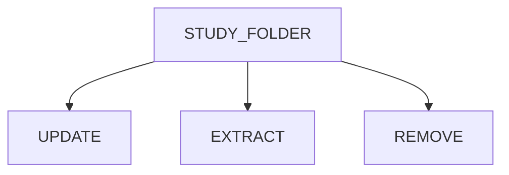

[](https://zenodo.org/doi/10.5281/zenodo.12806060)

# VARAN

<style>
.table-wrapper {
    overflow-x: scroll;
  }
</style>

<p align="center">

</p>

## Index
- [Introduction](#introduction)
- [Features](#features)
- [Installation Procedure](#installation-procedure)
- [Quickstart](#quickstart)
- [Options](#options)
- [Workflow](#workflow)
- [Usage](#usage)
- [Troubleshooting](#troubleshooting)

## Introduction  

<p align="justify">
Varan is a Python-based application that provides a pipeline to automatically prepare and manipulate cancer genomics data in the specific format supported by the <a href="https://www.cbioportal.org/">cBioPortal</a>.

## Features

* <u>Study Creation</u>
<br>This section provides, starting from row vcf files, a well-structured and validate study folder ready to be uploaded into the local instance of cBioPortal.

* <u>Study Manipulation</u>
<br> This section gives the user the possibility to work on already existing studies. In particular it is possible to merge studies or to update them by adding/extracting/removing samples.


## Installation Procedure

### Docker (recommended)

<details open>
  <summary><b>Prerequisites</b></summary>
  
&ensp; [Docker ](https://www.docker.com/)
</details>

<details open>
  <summary><b>Procedure</b></summary>

1. Open a terminal
2. Clone the repository folder:
```
git clone https://github.com/bioinformatics-policlinicogemelli/Varan-Pub.git
```
3. Build docker file
<br> ⚠️ This step can take about 30 minutes to 1 hour depending on the resources allocated to docker 
```
cd <Varan_folder_path>/Varan-Pub
docker build -t varan .
```
4. Run Varan to test the installation
```
docker run --rm -it varan -h
```

⚠️ for Windows users: some problems with git bash (git for Windows) has been reported. It is recommended to launch the docker command through [Powershell](https://learn.microsoft.com/en-us/powershell/scripting/overview?view=powershell-7.4)
</details>

### Local

<details open>
  <summary><b>Prerequisites</b></summary>

* <b>Variant Effect Predictor (VEP)</b><p align="justify">The Variant Effect Predictor <a href="https://www.ensembl.org/info/docs/tools/vep/index.html">VEP</a> is a tool used to determine the effect of variants (SNPs, insertions, deletions, CNVs or structural variants) on genes, transcripts, and protein sequence, as well as regulatory regions. <br>The steps to install VEP can be found <a href="https://www.ensembl.org/info/docs/tools/vep/script/vep_download.html"> here</a>, while DB and FASTA files can be downloaded <a href="http://www.ensembl.org/info/docs/tools/vep/script/vep_cache.html#cache)"> here</a>

* <b>vcf2maf</b><br><p align="justify"><a href="https://github.com/mskcc/vcf2maf/tree/main">vcf2maf</a> is the tool required for the conversion of vcf files in maf format ones. 
<br>All the installation info can be found <a href="https://github.com/mskcc/vcf2maf/tree/main">here</a>

* <b>Samtools</b> <br><p align="justify"><a href="https://www.htslib.org/">Samtools</a> is a suite of programs for interacting with high-throughput sequencing data. 
<br>All the installation info can be found <a href="https://www.htslib.org/download/">here</a>
</details>

<details open>
  <summary><b>Procedure</b></summary>

To correctly install and use Varan:
1. Open a terminal
2. Digit the following command to clone the repository folder: 
```
git clone https://github.com/bioinformatics-policlinicogemelli/Varan-Pub.git
```
3.  Install all the packages required (cbioimporter and oncokb-annotator)
```
cd <varan_folder_path>/varan-Pub
bash installer.sh
```
 
<p align="justify">
⚠️ <i>Depending on the python version it may be necessary to use pip3 instead of pip</i><br><br>
To test the installation and check if everything works, launch the main script <b>varan.py</b>: 

```
cd <varan_folder_path>/varan-Pub
python varan.py -h
```

<p align="justify">
⚠️ <i>If any error is printed while launching varan.py, check if step 3 completed without errors</i>
</details>

## Quickstart

<details open>
  <summary><b>Configuration file</b></summary>
The first step to start using Varan is to correctly set the configuration file <i>conf.ini</i>. <br>

⚠️ In next subparagraph, for each field the type of variable requested will be insert between angle brackets <>. For string two possible entry can be find: < 'string' > and < string >. In the first case it is request to insert text inside quotation marks (*i.e. DESCRIPTION='this is the description'*), while on the other one quotation marks are not requested (*i.e. PROJECT_NAME=study*).

This file is divided in 12 subsessions:
<details close>
<summary><u>Paths</u></summary>
In this section it's possible to specify the paths for Vep (VEP_PATH) and its cache (VEP_DATA) and fasta (REF_FASTA), vcf2maf (VCF2MAF), and ClinVar (CLINV). In CACHE it is possible to set Ensembl version (i.e. 111) 

```
[Paths]
VCF2MAF = < string >
CLINV = < string >
REF_FASTA = < string >
VEP_PATH = < string >
VEP_DATA= < string >
CACHE = < string >
```
⚠️ clinvar database can be downloaded <a href="https://ftp.ncbi.nlm.nih.gov/pub/clinvar/">here</a>

</details>
<details close>
<summary><u>Multiple</u></summary>

In this section it's possible to specify the paths in case of multiple SNV, CNV and/or CombinedOutput files analysis.   
```
[Multiple]
SNV= < string >
CNV= < string >
COMBOUT= < string >
```
⚠️ This section has to be filled only in case of input by file.

</details>
<details close>
<summary><u>OncoKB</u></summary>

In this section is possible to insert the personal <a href="https://www.oncokb.org/">oncoKB</a> key. This key is mandatory to execute the oncoKB annotation.

```
[OncoKB] ONCOKB
ONCOKB= < string >
```
⚠️ The request for the oncoKB key can be done <a href="https://www.oncokb.org/account/register">here</a>


</details>
<details close>
<summary><u>Project</u></summary>

In this section is possible to specify project info like study name, ID, description and profile. These info will be insert in meta files.
```
[Project]
PROJECT_ID = < string >
PROJECT_NAME = < string >
DESCRIPTION = < 'string' >
PROFILE_MUT = < 'string' >
PROFILE_CNA = < 'string' >
PROFILE_CNA_HG19 = < 'string' >
PROFILE_SV = < 'string' >
```

</details>
<details close>
<summary><u>Filters</u></summary>

Here it is possible to specify the filters' threshold to apply to SNV maf files (for more info about filters threshold setting see <a href="https://github.com/bioinformatics-policlinicogemelli/Varan-Pub/blob/readme/readme_content/doc/filters.md">here</a>).
```
[Filters]
BENIGN = < [string|string|...] > 
CLIN_SIG = < ['string','string',...] >
CONSEQUENCES = < ['string','string',...] >
ONCOKB_FILTER = < ['string','string',...] >
t_VAF_min = < int >
t_VAF_min_novel = < int >
t_VAF_max = < int >
AF = < string > 
POLYPHEN = < ['string','string',...] >
IMPACT = < ['string','string',...] >
SIFT = < ['string','string',...] >
```
⚠️ For AF the field can be populate with </>/<=/>=val (i.e. AF = >0.003)

</details close>
<details>
<summary><u>Cna</u></summary>

In this section user can insert CNV genotypes of interest and ploidy. The latter will be used to evaluate copy number discretization using <a href="https://cnvkit.readthedocs.io/en/stable/pipeline.html">cnvkit formula</a>.
```
[Cna]
HEADER_CNV = < ['string','string',...] >
PLOIDY = < int >
```
</details close>
<details>
<summary><u>TMB</u></summary>

Here TMB thresholds can be specified.

```
[TMB]
THRESHOLD = < {'string':'string', 'string':'string', ...} > 
```
i.e. THRESHOLD = {'Low':'<=5','Medium':'<10','High':'>=10'} where the string before : is the label assign to TMB value, while the other is the specific threshold (i.e. for a sample with TMB=15 a label HIGH will reported in the data clinical sample).

</details close>
<details>
<summary><u>MSI</u></summary>

Here MSI thresholds for sites and values can be specified.
```
[MSI]
THRESHOLD_SITES = < string >
THRESHOLD = < string >
```

⚠️ THRESHOLD_SITES value will be use only if MSI informations are extracted from combined variant output files. If MSI is directly reported as value inside the input tsv only THRESHOLD will be apply.

⚠️ Both THRESHOLD_SITES and THRESHOLD can be populate with </>/<=/>=val (i.e. THRESHOLD = <20)

</details close>
<details>
<summary><u>FUSION</u></summary>

Here Fusions thresholds can be specified.

```
[FUSION]
THRESHOLD = < string >
```
⚠️ THRESHOLD can be populate with </>/<=/>=val (i.e. THRESHOLD = >=15)

here are specified the Fusion thresholds.
</details>
<details close>
<summary><u>ClinicalSample</u></summary>

Here user can customize column name and type to write in the data_clinical_sample.txt.
```
[ClinicalSample]
HEADER_SAMPLE_SHORT = < ['string','string',...] >
HEADER_SAMPLE_LONG = < ['string','string',...] >
HEADER_SAMPLE_TYPE = < ['string','string',...] >
```
⚠️ HEADER_SAMPLE_TYPE accept only STRING, NUMBER, BOOLEAN. If different type is insert an error will be raised by Varan

⚠️ If these fields are left empty, a default Header will be produced.


</details>
<details close>
<summary><u>ClinicalPatient</u></summary>

Here user can customize column name and type to write in the data_clinical_patient.txt.
```
[ClinicalPatient]
HEADER_PATIENT_SHORT = < ['string','string',...] >
HEADER_PATIENT_LONG = < ['string','string',...] >
HEADER_PATIENT_TYPE = < ['string','string',...] >
```
⚠️ HEADER_PATIENT_TYPE accept only STRING, NUMBER, BOOLEAN. If different type is insert an error will be raised by Varan

⚠️ If these fields are left empty, a default Header will be produced.

</details>
<details>
<summary><u>Validation</u></summary>

If the user has a working cbioportal instance active on his computer, the location (http://localhost:8080) can be insert here. This value will be use for the validation of the output study and will produce a html report with the results.
```
[Validation]
PORT = < string >
```
⚠️ If this field is left empty an offline validation will be conducted
</details>
</details>

<br>
<details open>
  <summary><b>Workflow</b></summary>
<br>


<p align="justify"><br>Varan application can be divided in two distinct main blocks that require different inputs and provide different actions. The first block contains the functions to create a new study folder ex-novo, while the second one contains the functions to modify (Update/Extract/Remove samples) an existing study folder. To keep track of all operations performed, a complete log file and a versioning system are provided.

<br>
<details open>
  <summary><b>Block One: study creation</b></summary>

<br>


#### 1. Preparing Input

<p align="justify">
To create a new study folder, .vcf files are requested as input. This can be done through two types of input: A) <b>Folder</b>; B) <b>File(s)</b>

<details close>
  <summary><u>Folder</u></summary>

User must organize an input folder containing all of the vcf and tsv files requested following the structure reported below:

```
input_folder/
├── CNV
│   ├── 001.vcf
│   ├── 002.vcf
│   └── 003.vcf
├── SNV
│   ├── 001.vcf
│   ├── 002.vcf
│   └── 003.vcf
├── CombinedOutput
│   ├── 001_CombinedVariantOutput.tsv
│   ├── 002_CombinedVariantOutput.tsv
│   └── 003_CombinedVariantOutput.tsv
├── FUSIONS
│   └── Fusions.tsv
├── sample.tsv   
└── patient.tsv
```
Where:

* <b>SNV</b> folder contains all the single nucleotide variants files in vcf format
* <b>CNV</b> folder contains all the copy number variants files in vcf format
* <b>CombinedVariantOutput</b> folder contains all the combined variant output file in tsv format (this kind of files contains info about TMB, MSI and Fusions) 
* <b>FUSIONS</b> folder contains a template, fusion.tsv, to fill with fusion information in case combined variant output files are not available
* <b>sample.tsv</b> file, a template to fill with sample clinical info  
* <b>patient.tsv</b> file, a template to fill with patient clinical info 
</details>

<details close>
<summary><u>File(s)</u></summary>
User must compile several input file (by filling in specific templates):

* <b>sample.tsv</b> file, a template to fill with sample clinical info
* <b>fusions.tsv</b> file, a template to fill with fusion information
* <b>patient.tsv</b> file, a template to fill with patient clinical info 

⚠️ For this input at least <i>sample.tsv</i> file must be given to Varan
</details>
<br>
<details open>
  <summary><b>Template</b></summary>

For both input by folder and by file, template filling by user is requested.
Below will be briefly explained the structure of these templates:

<details close>
  <summary><i>sample.tsv</i></summary>

This template must be filled by user with all disposable sample clinical info and will be used to create the <i>data_clinical_sample.txt</i>.

⚠️ This file is mandatory for Varan analysis!

<div class="table-wrapper" markdown="block">

|SAMPLE_ID | PATIENT_ID | MSI | TMB| MSI_THR | TMB_THR| ONCOTREE_CODE| snv_path| cnv_path| comb_path|... |
|:---:|:---:|:---: |:---:   |:---:|:---:|:---:|:---:|:---:|:---:|:---:|
|0000000_DNA| 00000000  | 1| 12| ||BOWEL |path_to_snv|path_to_cnv|path_to_combined_output|...|
|0000001_DNA| 00000001  | 8.0| 8.0| ||UTERUS |path_to_snv|path_to_cnv|path_to_combined_output|...|
|0000003_DNA| 00000003  | 222| 127| ||BOWEL |path_to_snv|path_to_cnv|path_to_combined_output|...|
|...| ...  | ...| ...| ||... |...|...|...|...|

The obligatory fields to keep are:

* <u>SAMPLE_ID</u>: IDs of all samples of interest
* <u>PATIENT_ID</u>: IDs of all patient of interest
* <u>MSI</u>: MSI value for each of the samples
* <u>TMB</u>: TMB value for each of the samples
* <u>MSI_THR</u>: MSI categorization based on the threshold set in the <i>conf.ini</i> file. This field has to be left empty and will be filled by Varan
* <u>TMB_THR</u>: TMB categorization based on the threshold set in the <i>conf.ini</i> file. This field has to be left empty and will be filled by Varan
* <u>ONCOTREE_CODE</u>: code to associate for the oncokb annotation. Check <a href="https://oncotree.mskcc.org/#/home">here</a> for more info. 
* <u>snv_path</u>: path to the SNV vcf file. This column has to be filled in case of input by file.
* <u>cnv_path</u>: path to the CNV vcf file. This column has to be filled in case of input by file.
* <u>comb_path</u>: path to the combined output file. This column has to be filled in case of input by file.

⚠️ The user can add new columns starting from the last one. Modify or delete the default ones (even only by changing names) can lead to errors and is strongly not recommended.<br>
⚠️ SAMPLE_ID and PATIENT_ID must be filled.
⚠️ MSI and TMB columns will be considered only if no combined output. Conversely, even if filled in, the MSI and TMB values extracted from the above files will be taken into account.<br>
⚠️ ONCOTREECODE column is mandatory to fill for the oncoKB annotation <br>

</div>
</details>
<br>
<details close>
  <summary><i>patient.tsv</i></summary>

This template must be filled by user with all disposable patient clinical info and will be used to create the <i>data_clinical_patient.txt</i>.

⚠️ This file is optional, if missing a default <i>data_clinical_patient.txt</i> will be create.

<div class="table-wrapper" markdown="block">

|PATIENT_ID | AGE | GENDER | ...|
|:---:|:---:|:---:|:---:|
|00000000| 45  | F| ...| 
|00000001| 77  | F| ...| 
|00000003| 23  | M| ...| 
|...| ...  | ...|...| 
</div>

The obligatory fields to keep are:
* <u>PATIENT_ID</u>: IDs of all patient of interest

⚠️ The user can add new columns starting from PATIENT_ID. Modify or delete the default one (even only by changing name) can lead to errors and is strongly not recommended.<br>

</details>
<br>

<details close>
  <summary><i>fusions.tsv</i></summary>

This template must be filled by user with all disposable fusion info and will be used to create the <i>data_sv.txt</i>.

⚠️ This file is optional, if missing an empty <i>data_sv.txt</i> will be create.

<div class="table-wrapper" markdown="block">

|Sample_Id | SV_Status | Site1_Hugo_Symbol |Site2_Hugo_Symbol|...|
|:---:|:---:|:---:|:---:|:---:|
|0000000_DNA| SOMATIC  | APC| BRCA1|...|
|0000001_DNA| SOMATIC  | TP53| BRAF|...|
|0000003_DNA| SOMATIC  | ALK| BRCA2|...|
|...| ... | ...|...|...|
</div>

The obligatory fields to keep are:
* <u>Sample_Id</u>: IDs of all sample of interest
* <u>SV_Status</u>: fusion type
* <u>Site1_Hugo_Symbol</u>: first gene involved in fusion 
* <u>Site2_Hugo_Symbol</u>: second gene involved in fusion 

⚠️ The user can add new columns starting from Site2_Hugo_Symbol. Modify or delete the default ones (even only by changing names) can lead to errors and is strongly not recommended.<br>
⚠️ All the obligatory fields must be filled and cannot be empty.<br>
</details>
</details>

#### 2. Launch Varan main

These are the options that can be set for this block:

| Options | Description | Type | Required
|-----------------------------------|----------------| :---:| :---:|
|-i <br> --input| <p align="justify">Add this option to insert the path to the input tsv file/folder where the vcf files are listed|  | Yes
|-o <br> --output_folder| <p align="justify">Add this option to insert the path where to save the output folder| string | Yes
|-c <br> --cancer| <p align="justify">Add this option to specify a cancer type| string | Yes
|-f <br> --filter_snv| <p align="justify">Add this option to filter out from the vcf the variants with dot (.) and PASS in Alt and Filter column respectively | string | No
|-k <br> --onocoKB| <p align="justify">Add this option to annotate with oncoKB | boolean | No
|-t <br> --vcf_type|<p align="justify">Add this option to specify the type of file (snv/cnv/fus/tab) |string|No
|-w <br> --overWrite| <p align="justify">Add this option to overwrite output folder if already exists|boolean| No
|-R <br> --resume| <p align="justify">Add this option to resume an already started analysis <b>⚠️ *This option must be used with caution, because at the moment of  use it restarts from the checkpoint of MAF creation.</b>| boolean | No
|-m <br> --multiple| <p align="justify">Add this option to specify that it is a multi-sample file (a single VCF containing information from multiple patients) | boolean | No


**Example:**

* <ins>input folder -i </ins>: Launch this command to processing the contents of the input folder and saving the results to the specified output folder and the cancer type.
```
python varan.py -i <path_input_folder> -o <path_output_folder> -c <type_of_cancer>
```
* <ins>input file -i </ins>: Use this command to process the sample, patient, and fusion files, which must necessarily exist in the folder.

```
python varan.py -i <path_to_sample_file> -o <path_output_folder> -c <type_of_cancer> 
```
⚠️ This command for file usage can take as input one or up to a maximum of three file types(a list of file in this order sample,patient,fusion if we don't have the patient file in the command use "" ). Below, examples will be shown:

```
python varan.py -i sample.tsv patient.tsv -o output_folder -c mixed 

python varan.py -i sample.tsv patient.tsv fusion.tsv -o output_folder -c mixed

python varan.py -i sample.tsv "" fusion.tsv -o output_folder -c mixed
```
* <ins>input file -i and resume </ins>: Launch this command to resume an already started analysis.

```
python varan.py -i <path_to_sample_file> -o <path_output_folder> -c <type_of_cancer> -R
```
* <ins>input file -i and overwrite </ins>: Launch this command to overwritting the output.
⚠️ It's not possible use the -w (overwrite) and -R options together.

```
python varan.py -i <path_to_sample_file> -o <path_output_folder> -c <type_of_cancer> -w
```
* <ins>input file -i and multiple </ins>: Launch this command to specify that it is a multi-sample file.

```
python varan.py -i <path_to_sample_file> -o <path_output_folder> -c <type_of_cancer> -m
```
* <ins>use and select option filter -f </ins>: Launch this command to specify the type of filter that use.For filtering, depending on the options we select, there are various paths that will be followed, always starting with a VCF file. The VEP tool will create the MAF. At this point, we will have:

<p align="justify"> After the creation of the MAF, there will be a folder containing the MAF annotated only by VEP, and the creation of an additional filtered folder called MAF_Filtered (create if use -f option).
```
python varan.py -i <path_to_sample_file> -o <path_output_folder> -c <type_of_cancer> -f 
```

<p align="justify">If OncoKB comes into play, there will be a folder named and annotated maf.oncokb(use -k option) and another filtered called maf.oncokb_filtered (use -f option and -k option).

```
python varan.py -i <path_to_sample_file> -o <path_output_folder> -c <type_of_cancer> -f -k
```

These are other options that can be set:

Select filter for SNV [d -> filter, p -> filter==PASS , b-> Benign , v-> vaf, o-> Oncokb , g -> AF, q -> Consequence, y-> polyphens, c ->
                        clin_sig, n -> novel]


```
python varan.py -i <path_to_sample_file> -o <path_output_folder> -c <type_of_cancer> -f pb

NB:filter the PASS and Benign.
```

<p align="justify"> The thresholds and everything you want to include or exclude for filtering are present in the conf.ini file. Below is what our configuration includes and excludes.

| Filters | Type | Include
|-------------------------|----------------| :---:|
|CLIN_SIG <br> | <p align="justify">"risk_factor","pathogenic","likely_pathogenic","drug_response"| Yes
|CONSEQUENCES <br> | <p align="justify">"splice_region_variant","frameshift_variant","splice_donor_variant","stop_gained","splice_acceptor_variant","start_lost","inframe_insertion","inframe_deletion"| Yes
|ONCOKB_FILTER <br> | <p align="justify">"Likely Oncogenic","Oncogenic"| Yes
|BENIGN <br> | <p align="justify">benign\likely_benign| No
|POLYPHEN <br> | <p align="justify">"benign" | No
|IMPACT <br> |<p align="justify">   "LOW"| No
|SIFT <br> | <p align="justify">"tolerated"| No
 
 ⚠️ *There are other thresholds that involve a range of inclusion and exclusion, and they are:t_VAF_min=0.02;t_VAF_min_novel=0.05; t_VAF_max=0.98;AF=<0.0003*


#### 3. Output

<p align="justify"> After varan.py has run successfully, the resulted output folder should have the following organization and content:

```
cancer_name
├── data_clinical_sample.xlsx
├── case_lists
│   ├── cases_cna.txt
│   ├── cases_sequenced.txt
│   └── cases_sv.txt
├── data_clinical_patient.txt
├── data_clinical_sample.txt
├── data_cna.txt
├── data_cna_hg19.seg
├── data_mutations_extended.txt
├── data_sv.txt
├── meta_clinical_patient.txt
├── meta_clinical_sample.txt
├── meta_cna.txt
├── meta_cna_hg19_seg.txt
├── meta_mutations_extended.txt
├── meta_study.txt
└── meta_sv.txt
```

<p align="justify">
When updating/removing/extracting samples, a new study folder will be created within the output_folder with the name <i>updated_data</i> in which the modified files will be stored. 

### Block Two: Modify Existing Study Folders

<br>


#### Workflow


#### 1. Preparing Input

<p align="justify">The input for this block is a study folder correctly populated. It can be the output of the first block or an existing folder. Its structure must follow the one reported in the output paragraph. 

#### 2. Launch Varan main

These are the options that can be set if you want to update/extract/remove:

| Options | Input | Type | Required
|----------------|----------------| :---:| :---:|
|-u <br> --Update| <p align="justify">Add this option if you want to update an existing study folder| boolean | One between -u, -e or -r is required
|-e <br> --Extract| <p align="justify">Add this option if you want to extract samples from an existing study folder| boolean | One between -u, -e or -r is required
|-r <br> --Remove| <p align="justify">Add this option if you want to remove samples from an existing study folder| boolean | One between -u, -e or -r is required
|-p <br> --Path| <p align="justify">Add this option to specify the path of the existing study folder to update, or from which to remove/extract samples | string | Yes
|-s <br> --SampleList| <p align="justify">Add this option to insert the path of the .txt file containing the list of samples to remove/extract from the study folder| string | Only if the -e or -r option is selected
|-n <br> --NewPath| <p align="justify">Add this option to specify the path of the folder containing updated/new information to be loaded into the input folder| string | Only if the -u option is selected
|-N <br> --Name| <p align="justify">Add this option if you want to customize the studyID| string | No
|-o <br> --output_folder| <p align="justify">Add this option if you prefer to manually name the output folder, rather than automatically naming it as the new version of the input folder| string | Only if the -N option is selected


**Example:**

<p align="justify">
<ins>sample update</ins>: Launch this command to update a study folder by inserting or updating sample and clinical informations, and save the updated study as a new version of the input folder.

```
python varan.py -u -p <path_to_old_study_folder> -n <path_to_new_study_folder>
```
<p align="justify">
<ins>sample extraction</ins>: Launch this command to extract a list of samples from a study folder and save the new study containing only the extracted samples in the output path.

```
python varan.py -e -p <path_to_study_folder> -s <path_to_sample_list_file> -o <path_to_output_folder>
```
<p align="justify">
<ins>sample removal</ins>: Launch this command to remove a list of samples from a study folder and to save the new one without the removed samples in the output path, assigning a customized studyID.

```
python varan.py -r -p <path_to_study_folder> -s <path_to_sample_list_file> -o <path_to_output_folder> -N <new_studyID_in_meta>
```
#### 3. Output

<p align="justify">
After varan.py has run successfully, the resulting <i>output_folder</i> will be created and will contain the new files, following the same organization as described in the output paragraph of the Block One.
Additionally, it will include a summary.txt file that contains a report of the operation, detailing the samples added/updated/extracted/removed, as well as the total number of samples and patients in the final output folder.   


