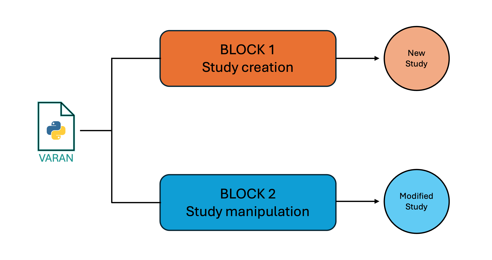
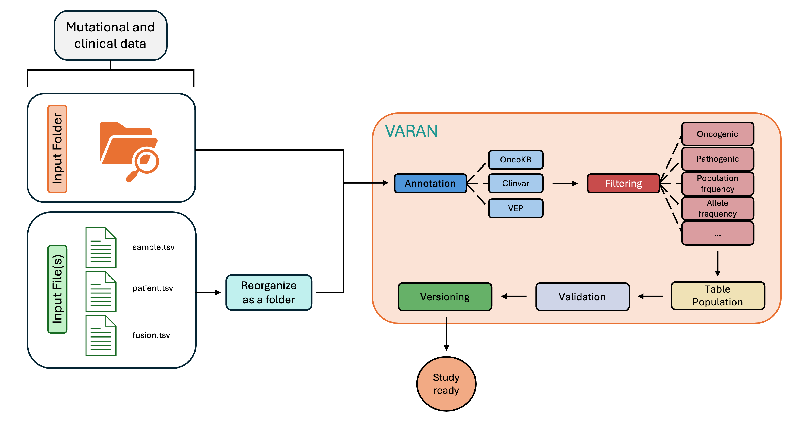

# VARAN

[](https://zenodo.org/doi/10.5281/zenodo.12806060)

<p align="center">

</p>

## Index
- [VARAN](#varan)
  - [Index](#index)
  - [Introduction](#introduction)
  - [Features](#features)
  - [Installation Procedure](#installation-procedure)
    - [Docker (recommended)](#docker-recommended)
    - [Local](#local)
  - [Quickstart](#quickstart)
    - [Block One: study creation](#block-one-study-creation)
      - [1. Preparing Input](#1-preparing-input)
      - [2. Launch Varan](#2-launch-varan)
        - [Ex 7) Filter vcf/maf:](#ex-7-filter-vcfmaf)
        - [Ex 7) Filter vcf/maf:](#ex-7-filter-vcfmaf-1)
      - [3. Output](#3-output)
    - [Block Two: study manipolation](#block-two-study-manipolation)
      - [1. Preparing Input](#1-preparing-input-1)
      - [2. Launch Varan main](#2-launch-varan-main)
      - [3. Output](#3-output-1)

## Introduction  

<p align="justify">
Varan is a Python-based application that provides a pipeline to automatically prepare and manipulate cancer genomics data in the specific format supported by the <a href="https://www.cbioportal.org/">cBioPortal</a>.

## Features

* <ins>Study Creation</ins>
<br>This section provides, starting from row vcf files, a well-structured and validate study folder ready to be uploaded into the local instance of cBioPortal.

* <ins>Study Manipulation</ins>
<br> This section gives the user the possibility to work on already existing studies. In particular it is possible to merge studies or to update them by adding/extracting/removing samples.


## Installation Procedure

### Docker (recommended)

<details open>
  <summary><b>Prerequisites</b></summary>
  
&ensp; [Docker](https://www.docker.com/)
</details>

<details open>
  <summary><b>Procedure</b></summary>

1. Open a terminal
2. Clone the repository folder:
```
git clone https://github.com/bioinformatics-policlinicogemelli/Varan-Pub.git
```
3. Build docker file
<br> ⚠️ This step can take about 30 minutes to 1 hour depending on the resources allocated to docker 
```
cd <Varan_folder_path>/Varan-Pub
docker build -t varan .
```
4. Run Varan to test the installation
```
docker run --rm -it varan -h
```

⚠️ for Windows users: some problems with git bash (git for Windows) has been reported. It is recommended to launch the docker command through [Powershell](https://learn.microsoft.com/en-us/powershell/scripting/overview?view=powershell-7.4)
</details>

### Local

<details open>
  <summary><b>Prerequisites</b></summary>

* <b>Variant Effect Predictor (VEP)</b><p align="justify">The Variant Effect Predictor <a href="https://www.ensembl.org/info/docs/tools/vep/index.html">VEP</a> is a tool used to determine the effect of variants (SNPs, insertions, deletions, CNVs or structural variants) on genes, transcripts, and protein sequence, as well as regulatory regions. <br>The steps to install VEP can be found <a href="https://www.ensembl.org/info/docs/tools/vep/script/vep_download.html"> here</a>, while DB and FASTA files can be downloaded <a href="http://www.ensembl.org/info/docs/tools/vep/script/vep_cache.html#cache)"> here</a>

* <b>vcf2maf</b><br><p align="justify"><a href="https://github.com/mskcc/vcf2maf/tree/main">vcf2maf</a> is the tool required for the conversion of vcf files in maf format ones. 
<br>All the installation info can be found <a href="https://github.com/mskcc/vcf2maf/tree/main">here</a>

* <b>Samtools</b> <br><p align="justify"><a href="https://www.htslib.org/">Samtools</a> is a suite of programs for interacting with high-throughput sequencing data. 
<br>All the installation info can be found <a href="https://www.htslib.org/download/">here</a>
</details>

<details open>
  <summary><b>Procedure</b></summary>

To correctly install and use Varan:
1. Open a terminal
2. Digit the following command to clone the repository folder: 
```
git clone https://github.com/bioinformatics-policlinicogemelli/Varan-Pub.git
```
3.  Install all the packages required (cbioimporter and oncokb-annotator)
```
cd <varan_folder_path>/varan-Pub
bash installer.sh
```
 
<p align="justify">
⚠️ <i>Depending on the python version it may be necessary to use pip3 instead of pip</i><br><br>
To test the installation and check if everything works, launch the main script <b>varan.py</b>: 

```
cd <varan_folder_path>/varan-Pub
python varan.py -h
```

<p align="justify">
⚠️ <i>If any error is printed while launching varan.py, check if step 3 completed without errors</i>
</details>

## Quickstart

<details open>
  <summary><b>Configuration file</b></summary>
The first step to start using Varan is to correctly set the configuration file <i>conf.ini</i>. <br><br>

⚠️ In next subparagraph, for each field the type of variable requested will be insert between angle brackets <>. For string two possible entry can be find: < 'string' > and < string >. In the first case it is request to insert text inside quotation marks (*i.e. DESCRIPTION='this is the description'*), while on the other one quotation marks are not requested (*i.e. PROJECT_NAME=study*).

This file is divided in 12 subsessions:
<details close>
<summary><ins>Paths</ins></summary>
In this section it's possible to specify the paths for Vep (VEP_PATH) and its cache (VEP_DATA) and fasta (REF_FASTA), vcf2maf (VCF2MAF), and ClinVar (CLINV). In CACHE it is possible to set Ensembl version (i.e. 111)

```
[Paths]
VCF2MAF = < string >
CLINV = < string >
REF_FASTA = < string >
VEP_PATH = < string >
VEP_DATA= < string >
CACHE = < string >
```
⚠️ clinvar database can be downloaded <a href="https://ftp.ncbi.nlm.nih.gov/pub/clinvar/">here</a>

</details>
<details close>
<summary><ins>Multiple</ins></summary>

In this section it's possible to specify the paths in case of multiple SNV, CNV and/or CombinedOutput files analysis.   
```
[Multiple]
SNV= < string >
CNV= < string >
COMBOUT= < string >
```
⚠️ This section has to be filled only in case of input by file.

</details>
<details close>
<summary><ins>OncoKB</ins></summary>

In this section is possible to insert the personal <a href="https://www.oncokb.org/">oncoKB</a> key. This key is mandatory to execute the oncoKB annotation.

```
[OncoKB] ONCOKB
ONCOKB= < string >
```
⚠️ The request for the oncoKB key can be done <a href="https://www.oncokb.org/account/register">here</a>


</details>
<details close>
<summary><ins>Project</ins></summary>

In this section is possible to specify project info like study name, ID, description and profile. These info will be insert in meta files.
```
[Project]
PROJECT_ID = < string >
PROJECT_NAME = < string >
DESCRIPTION = < 'string' >
PROFILE_MUT = < 'string' >
PROFILE_CNA = < 'string' >
PROFILE_CNA_HG19 = < 'string' >
PROFILE_SV = < 'string' >
```

</details>
<details close>
<summary><ins>Filters</ins></summary>

Here it is possible to specify the filters' threshold to apply to SNV maf files (for more info about filters threshold setting see [Ex 7)](#ex-7-filter-vcfmaf).
```
[Filters]
BENIGN = < [string|string|...] > 
CLIN_SIG = < ['string','string',...] >
CONSEQUENCES = < ['string','string',...] >
ONCOKB_FILTER = < ['string','string',...] >
t_VAF_min = < int >
t_VAF_min_novel = < int >
t_VAF_max = < int >
AF = < string > 
POLYPHEN = < ['string','string',...] >
IMPACT = < ['string','string',...] >
SIFT = < ['string','string',...] >
```
⚠️ For AF the field can be populate with </>/<=/>=val (i.e. AF = >0.003)

</details close>
<details>
<summary><ins>Cna</ins></summary>

In this section user can insert CNV genotypes of interest and ploidy. The latter will be used to evaluate copy number discretization using <a href="https://cnvkit.readthedocs.io/en/stable/pipeline.html">cnvkit formula</a>.
```
[Cna]
HEADER_CNV = < ['string','string',...] >
PLOIDY = < int >
```
</details close>
<details>
<summary><ins>TMB</ins></summary>

Here TMB thresholds can be specified.

```
[TMB]
THRESHOLD = < {'string':'string', 'string':'string', ...} > 
```
i.e. THRESHOLD = {'Low':'<=5','Medium':'<10','High':'>=10'} where the string before : is the label assign to TMB value, while the other is the specific threshold (i.e. for a sample with TMB=15 a label HIGH will reported in the data clinical sample).

</details close>
<details>
<summary><ins>MSI</ins></summary>

Here MSI thresholds for sites and values can be specified.
```
[MSI]
THRESHOLD_SITES = < string >
THRESHOLD = < string >
```

⚠️ THRESHOLD_SITES value will be use only if MSI informations are extracted from combined variant output files. If MSI is directly reported as value inside the input tsv only THRESHOLD will be apply.

⚠️ Both THRESHOLD_SITES and THRESHOLD can be populate with </>/<=/>=val (i.e. THRESHOLD = <20)

</details close>
<details>
<summary><ins>FUSION</ins></summary>

Here Fusions thresholds can be specified.

```
[FUSION]
THRESHOLD = < string >
```
⚠️ THRESHOLD can be populate with </>/<=/>=val (i.e. THRESHOLD = >=15)

here are specified the Fusion thresholds.
</details>
<details close>
<summary><ins>ClinicalSample</ins></summary>

Here user can customize column name and type to write in the data_clinical_sample.txt.
```
[ClinicalSample]
HEADER_SAMPLE_SHORT = < ['string','string',...] >
HEADER_SAMPLE_LONG = < ['string','string',...] >
HEADER_SAMPLE_TYPE = < ['string','string',...] >
```
⚠️ HEADER_SAMPLE_TYPE accept only STRING, NUMBER, BOOLEAN. If different type is insert an error will be raised by Varan

⚠️ If these fields are left empty, a default Header will be produced.

</details>
<details close>
<summary><ins>ClinicalPatient</ins></summary>

Here user can customize column name and type to write in the data_clinical_patient.txt.
```
[ClinicalPatient]
HEADER_PATIENT_SHORT = < ['string','string',...] >
HEADER_PATIENT_LONG = < ['string','string',...] >
HEADER_PATIENT_TYPE = < ['string','string',...] >
```
⚠️ HEADER_PATIENT_TYPE accept only STRING, NUMBER, BOOLEAN. If different type is insert an error will be raised by Varan

⚠️ If these fields are left empty, a default Header will be produced.

</details>
<details>
<summary><ins>Validation</ins></summary>

If the user has a working cbioportal instance active on his computer, the location (http://localhost:8080) can be insert here. This value will be use for the validation of the output study and will produce a html report with the results.
```
[Validation]
PORT = < string >
```
⚠️ If this field is left empty an offline validation will be conducted
</details>

⚠️ For Docker a partially compiled configuration file (<i>docker.ini</i>) with vep and clinvar path set is available
</details>

<br>
<details open>
  <summary><b>Workflow</b></summary>
<br>

<p align="center">
  
</p>

<p align="justify"><br>Varan application can be divided in two distinct main blocks that require different inputs and provide different actions. The first block contains the functions to create a new study folder ex-novo, while the second one contains the functions to modify (Update/Extract/Remove samples) an existing study folder. To keep track of all operations performed, a complete log file and a versioning system are provided.
</details>

### Block One: study creation

<br>

<p align="center">
  
</p>

#### 1. Preparing Input

<p align="justify">
To create a new study folder, .vcf files are requested as input. This can be done through two types of input: A) <b>Folder</b>; B) <b>File(s)</b>

<details close>
  <summary><ins>Folder</ins></summary>

User must organize an input folder containing all of the vcf and tsv files requested following the structure reported below:

```
input_folder/
├── CNV
│   ├── 001.vcf
│   ├── 002.vcf
│   └── 003.vcf
├── SNV
│   ├── 001.vcf
│   ├── 002.vcf
│   └── 003.vcf
├── CombinedOutput
│   ├── 001_CombinedVariantOutput.tsv
│   ├── 002_CombinedVariantOutput.tsv
│   └── 003_CombinedVariantOutput.tsv
├── FUSIONS
│   └── Fusions.tsv
├── sample.tsv   
└── patient.tsv
```

Where:

* <b>SNV</b> folder contains all the single nucleotide variants files in vcf format
* <b>CNV</b> folder contains all the copy number variants files in vcf format
* <b>CombinedVariantOutput</b> folder contains all the combined variant output file in tsv format (this kind of files contains info about TMB, MSI and Fusions) 
* <b>FUSIONS</b> folder contains a template, fusion.tsv, to fill with fusion information in case combined variant output files are not available
* <b>sample.tsv</b> file, a template to fill with sample clinical info  
* <b>patient.tsv</b> file, a template to fill with patient clinical info 
</details>

<details close>
<summary><ins>File(s)</ins></summary>
User must compile several input file (by filling in specific templates):

* <b>sample.tsv</b> file, a template to fill with sample clinical info
* <b>fusions.tsv</b> file, a template to fill with fusion information
* <b>patient.tsv</b> file, a template to fill with patient clinical info 

⚠️ For this input at least <i>sample.tsv</i> file must be given to Varan
</details>
<br>
<details open>
  <summary><b>Template</b></summary>

For both input by folder and by file, template filling by user is requested.
Below will be briefly explained the structure of these templates:

<details close>
  <summary><i>sample.tsv</i></summary>
This template must be filled by user with all disposable sample clinical info and will be used to create the <i>data_clinical_sample.txt</i>.

⚠️ This file is mandatory for Varan analysis!

|SAMPLE_ID | PATIENT_ID | MSI | TMB| MSI_THR | TMB_THR| ONCOTREE_CODE| snv_path| cnv_path| comb_path|... |
|:---:|:---:|:---: |:---:   |:---:|:---:|:---:|:---:|:---:|:---:|:---:|
|0000000_DNA| 00000000  | 1| 12| ||BOWEL |path_to_snv|path_to_cnv|path_to_combined_output|...|
|0000001_DNA| 00000001  | 8.0| 8.0| ||UTERUS |path_to_snv|path_to_cnv|path_to_combined_output|...|
|0000003_DNA| 00000003  | 222| 127| ||BOWEL |path_to_snv|path_to_cnv|path_to_combined_output|...|
|...| ...  | ...| ...| ||... |...|...|...|...|

The obligatory fields to keep are:

* <ins>SAMPLE_ID</ins>: IDs of all samples of interest
* <ins>PATIENT_ID</ins>: IDs of all patient of interest
* <ins>MSI</ins>: MSI value for each of the samples
* <ins>TMB</ins>: TMB value for each of the samples
* <ins>MSI_THR</ins>: MSI categorization based on the threshold set in the <i>conf.ini</i> file. This field has to be left empty and will be filled by Varan
* <ins>TMB_THR</ins>: TMB categorization based on the threshold set in the <i>conf.ini</i> file. This field has to be left empty and will be filled by Varan
* <ins>ONCOTREE_CODE</ins>: code to associate for the oncokb annotation. Check <a href="https://oncotree.mskcc.org/#/home">here</a> for more info. 
* <ins>snv_path</ins>: path to the SNV vcf file. This column has to be filled in case of input by file.
* <ins>cnv_path</ins>: path to the CNV vcf file. This column has to be filled in case of input by file.
* <ins>comb_path</ins>: path to the combined output file. This column has to be filled in case of input by file.

⚠️ The user can add new columns starting from the last one. Modify or delete the default ones (even only by changing names) can lead to errors and is strongly not recommended.<br>
⚠️ SAMPLE_ID and PATIENT_ID must be filled.<br>
⚠️ MSI and TMB columns will be considered only if no combined output. Conversely, even if filled in, the MSI and TMB values extracted from the above files will be taken into account.<br>
⚠️ ONCOTREECODE column is mandatory to fill for the oncoKB annotation

</details>
<details close>
  <summary><i>patient.tsv</i></summary>

This template must be filled by user with all disposable patient clinical info and will be used to create the <i>data_clinical_patient.txt</i>.

⚠️ This file is optional, if missing a default <i>data_clinical_patient.txt</i> will be create.


|PATIENT_ID | AGE | GENDER | ...|
|:---:|:---:|:---:|:---:|
|00000000| 45  | F| ...| 
|00000001| 77  | F| ...| 
|00000003| 23  | M| ...| 
|...| ...  | ...|...| 

The obligatory fields to keep are:
* <ins>PATIENT_ID</ins>: IDs of all patient of interest

⚠️ The user can add new columns starting from PATIENT_ID. Modify or delete the default one (even only by changing name) can lead to errors and is strongly not recommended.<br>

</details>

<details close>
  <summary><i>fusions.tsv</i></summary>

This template must be filled by user with all disposable fusion info and will be used to create the <i>data_sv.txt</i>.

⚠️ This file is optional, if missing an empty <i>data_sv.txt</i> will be create.

|Sample_Id | SV_Status | Site1_Hugo_Symbol |Site2_Hugo_Symbol|...|
|:---:|:---:|:---:|:---:|:---:|
|0000000_DNA| SOMATIC  | APC| BRCA1|...|
|0000001_DNA| SOMATIC  | TP53| BRAF|...|
|0000003_DNA| SOMATIC  | ALK| BRCA2|...|
|...| ... | ...|...|...|

The obligatory fields to keep are:
* <ins>Sample_Id</ins>: IDs of all sample of interest
* <ins>SV_Status</ins>: fusion type
* <ins>Site1_Hugo_Symbol</ins>: first gene involved in fusion 
* <ins>Site2_Hugo_Symbol</ins>: second gene involved in fusion 

⚠️ The user can add new columns starting from Site2_Hugo_Symbol. Modify or delete the default ones (even only by changing names) can lead to errors and is strongly not recommended.<br>
⚠️ All the obligatory fields must be filled and cannot be empty.<br>
</details>
</details>

#### 2. Launch Varan

The possible option to launch varan main for block 1 are:

| Options | Description | Type | Required
|:---|:---|:---:|:---:|
|<div style="width:130px">-i --input</div>| <div style="width:220px"><p align="justify">Add this option to insert the path to the input folder or the list of input files </div>| string list | Yes
|-o --output_folder| <p align="justify">Add this option to insert the path where to save the output folder| string | Yes
|-c --cancer| <p align="justify">Add this option to specify cancer type| string | Yes
|-f --filter| <p align="justify">Add this option to filter out variants from vcf/maf | string | No
|-k --onocoKB| <p align="justify">Add this option to annotate with oncoKB | boolean | No
|-t --analysis_type|<p align="justify">Add this option to specify the type of file (snv/cnv/fus/tab) to analyze. If not specified all analysis will be done |string|No
|-w --overWrite| <p align="justify">Add this option to overwrite output folder if already exists|boolean| No
|-R --resume| <p align="justify">Add this option to resume an already started analysis.<br><br>⚠️This option must be used with caution, because it assumes that the previous VCF to MAF conversion step was successful. <b></b>| boolean | No
|-m --multiple| <p align="justify">Add this option to specify that input is a multi-sample vcf file (a single VCF containing information from multiple patients) | boolean | No

<br>
<details open>
  <summary><i>Examples</i></summary>

<details open>
  <summary><i>Docker version</i></summary>

To launch Varan docker version is mandatory to mount sevaral volumes (-v) for granting a correct functioning.
```
docker run --rm -it -v <output_folder>:/output -v <vep_cache_path>:/vep_cache -v <ref_fasta_path>:/ref_fasta varan <commands>
```
⚠️ 


Ex 1) <ins>Launch Varan base analysis with input folder</ins>:

Launch this command to process the contents of the input folder 

```
docker run --rm -it -v <output_folder>:/output -v <vep_cache_path>:/vep_cache -v <ref_fasta_path>:/ref_fasta:/ref_fasta varan <commands> varan -i <path_input_folder> -o /output/<output_name> -c <type_of_cancer>
```
Ex 2) <ins>Launch Varan base analysis with input file</ins>:

Launch one of these commands to process the contents of the input file(s)

```
docker run --rm -it -v <output_folder>:/output -v <vep_cache_path>:/vep_cache -v <ref_fasta_path>:/ref_fasta varan -i sample.tsv patient.tsv -o /output/<output_name> -c mixed 

docker run --rm -it -v <output_folder>:/output -v <vep_cache_path>:/vep_cache -v <ref_fasta_path>:/ref_fasta varan -i sample.tsv patient.tsv fusion.tsv -o /output/<output_name> -c mixed

docker run --rm -it -v <output_folder>:/output -v <vep_cache_path>:/vep_cache -v <ref_fasta_path>:/ref_fasta varan -i sample.tsv "" fusion.tsv -o /output/<output_name> -c mixed
```
Ex 3) <ins>Multiple vcf analysis</ins>: 

Launch this command to specify that it is a multi-sample file.
```
docker run --rm -it -v <output_folder>:/output -v <vep_cache_path>:/vep_cache -v <ref_fasta_path>:/ref_fasta varan -i <path_to_sample_file> -o /output/<output_name> -c <type_of_cancer> -m
```
Ex 4) <ins>Overwrite analysis</ins>:

Launch this command to overwrite the output folder
```
docker run --rm -it -v <output_folder>:/output -v <vep_cache_path>:/vep_cache -v <ref_fasta_path>:/ref_fasta varan -i <path_to_sample_file> -o /output/<output_name> -c <type_of_cancer> -w
```
Ex 5) <ins>Resume analysis</ins>:

Launch this command to resume an already started analysis
```
docker run --rm -it -v <output_folder>:/output -v <vep_cache_path>:/vep_cache -v <ref_fasta_path>:/ref_fasta varan -i <path_to_sample_file> -o /output/<output_name> -c <type_of_cancer> -R
```
Ex 6) <ins>Specify analysis</ins>:

Launch one of these commands to specify the analysis 

* snv -> only snv analysis 
* cnv -> only cnv analysis
* fus -> only fusion analysis
* tab -> only meta file creation
```
docker run --rm -it -v <output_folder>:/output -v <vep_cache_path>:/vep_cache -v <ref_fasta_path>:/ref_fasta varan -i <path_to_sample_file> -o /output/<output_name> -c <type_of_cancer> -t snv
docker run --rm -it -v <output_folder>:/output -v <vep_cache_path>:/vep_cache -v <ref_fasta_path>:/ref_fasta varan -i <path_to_sample_file> -o /output/<output_name> -c <type_of_cancer> -t cnv
docker run --rm -it -v <output_folder>:/output -v <vep_cache_path>:/vep_cache -v <ref_fasta_path>:/ref_fasta varan -i <path_to_sample_file> -o /output/<output_name> -c <type_of_cancer> -t fus
docker run --rm -it -v <output_folder>:/output -v <vep_cache_path>:/vep_cache -v <ref_fasta_path>:/ref_fasta varan -i <path_to_sample_file> -o /output/<output_name> -c <type_of_cancer> -t tab
```
##### Ex 7) <ins>Filter vcf/maf</ins>:

Launch this command to specify the type of filter that use

* <code style="color : cyan">d</code> -> filter out from snv mutations with ALT="." and FILTER="PASS" 
* <code style="color : cyan">p</code> -> filter out from MAF mutations with FILTER="PASS" 
* <code style="color : cyan">b</code>-> filter out from MAF mutations with CLIN_SIG values <ins>equals</ins> to the ones specified in <i>conf.ini</i> BENIGN field
* <code style="color : cyan">i</code>-> filter out from MAF mutations with IMPACT <ins>equals</ins> to to the ones specified in <i>conf.ini</i> IMPACT field 
* <code style="color : cyan">v</code>-> filter out from MAF mutations with vaf (t_VF column) values <ins>not in</ins> the ranges [t_VAF_min; t_VAF_max] specified in <i>conf.ini</i>
* <code style="color : cyan">n</code> -> apply a specific VAF filter to novel mutations (dbSNP_RS = "novel") filtering out from MAF novel mutations with vaf inferior to <i>conf.ini</i> t_VAF_min_novel
* <code style="color : cyan">o</code>-> filter out from MAF mutations with ONCOGENIC values <ins>not equals</ins> to the ones specified in <i>conf.ini</i> ONCOKB_FILTER field
* <code style="color : cyan">a</code> -> filter out from MAF mutations with AF values outside the range specified in <i>conf.ini</i>
* <code style="color : cyan">q</code> -> filter out from MAF mutations with Consequence values <ins>different</ins> to the ones specified in <i>conf.ini</i> CONSEQUENCES field
* <code style="color : cyan">y</code>-> filter out from MAF mutations with PolyPhen values <ins>different</ins> to the ones specified in <i>conf.ini</i> POLYPHEN field 
* <code style="color : cyan">c</code> -> filter out from MAF mutations with CLIN_SIG values <ins>different</ins> to the ones specified in <i>conf.ini</i> CLIN_SIG field 

```
docker run --rm -it -v <output_folder>:/output -v <vep_cache_path>:/vep_cache -v <ref_fasta_path>:/ref_fasta varan -i <path_to_sample_file> -o /output/<output_name> -c <type_of_cancer> -f p
docker run --rm -it -v <output_folder>:/output -v <vep_cache_path>:/vep_cache -v <ref_fasta_path>:/ref_fasta varan -i <path_to_sample_file> -o /output/<output_name> -c <type_of_cancer> -f dpb
docker run --rm -it -v <output_folder>:/output -v <vep_cache_path>:/vep_cache -v <ref_fasta_path>:/ref_fasta varan -i <path_to_sample_file> -o /output/<output_name> -c <type_of_cancer> -k -f dpo
```

⚠️ More than one filter can be applied simultaneously<br>
⚠️ oncokb filter (o) required -k option
</details>

<details open>
  <summary><i>Local version</i></summary>

Ex 1) <ins>Launch Varan base analysis with input folder</ins>:

Launch this command to process the contents of the input folder 

```
python varan.py -i <path_input_folder> -o <path_output_folder> -c <type_of_cancer>
```
Ex 2) <ins>Launch Varan base analysis with input file</ins>:

Launch one of these commands to process the contents of the input file(s)

```
python varan.py -i sample.tsv patient.tsv -o output_folder -c mixed 

python varan.py -i sample.tsv patient.tsv fusion.tsv -o output_folder -c mixed

python varan.py -i sample.tsv "" fusion.tsv -o output_folder -c mixed
```
Ex 3) <ins>Multiple vcf analysis</ins>: 

Launch this command to specify that it is a multi-sample file.
```
python varan.py -i <path_to_sample_file> -o <path_output_folder> -c <type_of_cancer> -m
```
Ex 4) <ins>Overwrite analysis</ins>:

Launch this command to overwrite the output folder
```
python varan.py -i <path_to_sample_file> -o <path_output_folder> -c <type_of_cancer> -w
```
Ex 5) <ins>Resume analysis</ins>:

Launch this command to resume an already started analysis
```
python varan.py -i <path_to_sample_file> -o <path_output_folder> -c <type_of_cancer> -R
```
Ex 6) <ins>Specify analysis</ins>:

Launch one of these commands to specify the analysis 

* snv -> only snv analysis 
* cnv -> only cnv analysis
* fus -> only fusion analysis
* tab -> only meta file creation
```
python varan.py -i <path_to_sample_file> -o <path_output_folder> -c <type_of_cancer> -t snv
python varan.py -i <path_to_sample_file> -o <path_output_folder> -c <type_of_cancer> -t cnv
python varan.py -i <path_to_sample_file> -o <path_output_folder> -c <type_of_cancer> -t fus
python varan.py -i <path_to_sample_file> -o <path_output_folder> -c <type_of_cancer> -t tab
```
##### Ex 7) <ins>Filter vcf/maf</ins>:

Launch this command to specify the type of filter that use

* <code style="color : cyan">d</code> -> filter out from snv mutations with ALT="." and FILTER="PASS" 
* <code style="color : cyan">p</code> -> filter out from MAF mutations with FILTER="PASS" 
* <code style="color : cyan">b</code>-> filter out from MAF mutations with CLIN_SIG values <ins>equals</ins> to the ones specified in <i>conf.ini</i> BENIGN field
* <code style="color : cyan">i</code>-> filter out from MAF mutations with IMPACT <ins>equals</ins> to to the ones specified in <i>conf.ini</i> IMPACT field 
* <code style="color : cyan">v</code>-> filter out from MAF mutations with vaf (t_VF column) values <ins>not in</ins> the ranges [t_VAF_min; t_VAF_max] specified in <i>conf.ini</i>
* <code style="color : cyan">n</code> -> apply a specific VAF filter to novel mutations (dbSNP_RS = "novel") filtering out from MAF novel mutations with vaf inferior to <i>conf.ini</i> t_VAF_min_novel
* <code style="color : cyan">o</code>-> filter out from MAF mutations with ONCOGENIC values <ins>not equals</ins> to the ones specified in <i>conf.ini</i> ONCOKB_FILTER field
* <code style="color : cyan">a</code> -> filter out from MAF mutations with AF values outside the range specified in <i>conf.ini</i>
* <code style="color : cyan">q</code> -> filter out from MAF mutations with Consequence values <ins>different</ins> to the ones specified in <i>conf.ini</i> CONSEQUENCES field
* <code style="color : cyan">y</code>-> filter out from MAF mutations with PolyPhen values <ins>different</ins> to the ones specified in <i>conf.ini</i> POLYPHEN field 
* <code style="color : cyan">c</code> -> filter out from MAF mutations with CLIN_SIG values <ins>different</ins> to the ones specified in <i>conf.ini</i> CLIN_SIG field 

```
python varan.py -i <path_to_sample_file> -o <path_output_folder> -c <type_of_cancer> -f p
python varan.py -i <path_to_sample_file> -o <path_output_folder> -c <type_of_cancer> -f dpb
python varan.py -i <path_to_sample_file> -o <path_output_folder> -c <type_of_cancer> -k -f dpo
```

⚠️ More than one filter can be applied simultaneously<br>
⚠️ oncokb filter (o) required -k option

</details>
</details>

#### 3. Output

<p align="justify"> After varan.py has run successfully, the resulted output folder will have the following organization and content:

```
study_name
├── data_clinical_sample.xlsx
├── case_lists
│   ├── cases_cna.txt
│   ├── cases_sequenced.txt
│   └── cases_sv.txt
├── data_clinical_patient.txt
├── data_clinical_sample.txt
├── data_cna.txt
├── data_cna_hg19.seg
├── data_mutations_extended.txt
├── data_sv.txt
├── meta_clinical_patient.txt
├── meta_clinical_sample.txt
├── meta_cna.txt
├── meta_cna_hg19_seg.txt
├── meta_mutations_extended.txt
├── meta_study.txt
├── meta_sv.txt
├── MAF_OncoKB (*)
├── MAF_Filtered (**)
├── MAF_Onco_filtered (**)
└── maf.zip
```
(*) MAF_OncoKB folder will be create only in -k option in set and will contain all the MAF annotated with oncoKB.<br>
(**) Filtered MAF will be stored respectively inside MAF_Onco_filtered or MAF_Filtered if MAFs were annotated with oncokb or not.

<br>

### Block Two: study manipolation

<br>

<p align="center">
  
</p>

#### 1. Preparing Input

<p align="justify">The input for this block is a study folder correctly populated. It can be the output of the first block or an existing study folder downloaded from cBioPortal. 

Based on the requested type of action (Update, Extract, Remove), the other principle input can be another study folder or a sample list tsv file.

#### 2. Launch Varan main

The possible option to launch varan main for block 2 are:

| Options | Input | Type | Required
|----------------|----------------| :---:| :---:|
|-u <br> --Update| <p align="justify">Add this option if you want to update an existing study folder| boolean | One between -u, -e or -r is required
|-e <br> --Extract| <p align="justify">Add this option if you want to extract samples from an existing study folder| boolean | One between -u, -e or -r is required
|-r <br> --Remove| <p align="justify">Add this option if you want to remove samples from an existing study folder| boolean | One between -u, -e or -r is required
|-p <br> --Path| <p align="justify">Add this option to specify the path of the existing study folder to update, or from which to remove/extract samples | string | Yes
|-s <br> --SampleList| <p align="justify">Add this option to insert the path of the .txt file containing the list of samples to remove/extract from the study folder| string | Only if the -e or -r option is selected
|-n <br> --NewPath| <p align="justify">Add this option to specify the path of the study folder containing updated/new information| string | Only if the -u option is selected
|-N <br> --Name| <p align="justify">Add this option if you want to customize the study name (studyID)| string | No
|-o <br> --output_folder| <p align="justify">Add this option to specify the path where to save the output folder| string | Only if the -N option is selected

<br>
<details open>
  <summary><i>Examples</i></summary>

<details open>
  <summary><i>Docker version</i></summary>

To launch Varan docker version is mandatory to mount at least output folder for granting a correct functioning.
```
docker run --rm -it -v <output_folder>:/output varan <commands>
```
Ex 1) <ins>Update a study folder</ins>: 
<p align="justify">Launch this command to update a study folder

```
docker run --rm -it -v <output_folder>:/output varan -u -p <path_to_old_study_folder> -n <path_to_new_study_folder> -o /output/<path_to_output_folder>
```
Ex 2) <ins>Extract a study with a subset of samples</ins>: 
<p align="justify">Launch this command to extract a list of samples from a study folder and create a new study containing only these samples in the output path.

```
docker run --rm -it -v <output_folder>:/output  varan -e -p <path_to_study_folder> -s <path_to_sample_list_file> -o /output/<path_to_output_folder>
```

Ex 3) <ins>Remove samples from a study</ins>:
<p align="justify">Launch this command to remove a list of samples from a study folder and save a new study without them in the output path, assigning a customized the study name.

```
docker run --rm -it -v <output_folder>:/output -v <vep_cache_path>:/vep_cache -v <ref_fasta_path>:/ref_fasta varan -r -p <path_to_study_folder> -s <path_to_sample_list_file> -o /output/<path_to_output_folder> -N <new_studyID_in_meta>
```

</details>

<details open>
  <summary><i>Local version</i></summary>

Ex 1) <ins>Update a study folder</ins>: 
<p align="justify">Launch this command to update a study folder

```
python varan.py -u -p <path_to_old_study_folder> -n <path_to_new_study_folder>
```
Ex 2) <ins>Extract a study with a subset of samples</ins>: 
<p align="justify">Launch this command to extract a list of samples from a study folder and create a new study containing only these samples in the output path.

```
python varan.py -e -p <path_to_study_folder> -s <path_to_sample_list_file> -o <path_to_output_folder>
```

Ex 3) <ins>Remove samples from a study</ins>:
<p align="justify">Launch this command to remove a list of samples from a study folder and save a new study without them in the output path, assigning a customized the study name.

```
python varan.py -r -p <path_to_study_folder> -s <path_to_sample_list_file> -o <path_to_output_folder> -N <new_studyID_in_meta>
```
</details>

#### 3. Output

After varan.py has run successfully, the resulting <i>output_folder</i> will have the organization reported in [block 1](#3-output). 

Additionally, it will include a summary.txt file that will contain a report of the operation done, detailing the samples added/updated/extracted/removed, as well as the total number of samples and patients in the final study folder.
