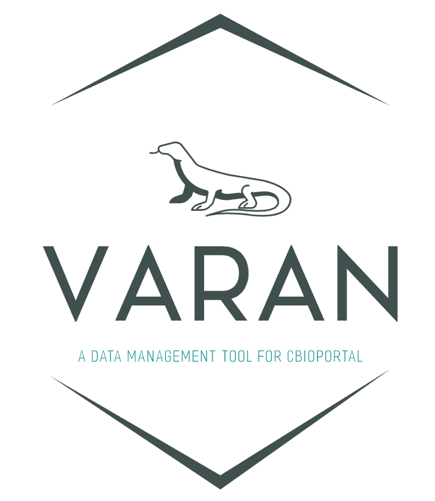

# VARAN

[](https://zenodo.org/doi/10.5281/zenodo.12806060)
[](LICENSE)
[](https://bioinformatics-policlinicogemelli.github.io/Varan/)

<p align="center">

</p>

<p align="justify">
Varan turns raw variant-calling output (VCF, MAF, Illumina TSO500 <code>CombinedVariantOutput</code>/<code>MetricsOutput</code>, and more) into a fully structured, validated cancer study ready to load into <a href="https://www.cbioportal.org/">cBioPortal</a> - no manual file wrangling required. It also manages the full lifecycle of an existing study: versioning, merging new batches in, extracting or removing samples, and re-validating along the way.
</p>

📚 **[Full documentation](https://bioinformatics-policlinicogemelli.github.io/Varan/)** · 🚀 **[Quick Start](https://bioinformatics-policlinicogemelli.github.io/Varan/quickstart.html)** · 📖 **[User Guide](https://bioinformatics-policlinicogemelli.github.io/Varan/user_guide.html)**

## Why Varan

- **One command, a whole cBioPortal study.** Point Varan at your VCFs/MAFs (or a TSV of per-sample file paths) and get a validated, versioned study folder out - clinical/patient tables, mutations, CNA, structural variants, case lists and meta files all generated and cross-consistent.
- **Built for real lab workflows.** Input is a TSV listing each sample's file paths, not a pre-combined folder - because sequencing and analysis files usually can't be moved into one place. SNV, CNV and fusion oncogenicity filters are each independently configurable, so a lab can, say, keep CNV VUS while excluding SNV VUS.
- **Study lifecycle management.** Update a study with a new batch of samples, extract a subset into its own study, or remove samples - each operation produces a new, validated, version-tracked folder rather than mutating data in place.
- **TSO500-aware.** Reads TMB, MSI, fusions, HRD/Genomic Instability Score, and exon-level BRCA1/BRCA2 CNVs straight out of Illumina's `CombinedVariantOutput`/`MetricsOutput` files, alongside standard VCF/MAF input.
- **Validated, not just generated.** Every run is checked against cBioPortal's own offline validator, with an HTML report summarizing what passed, what needs review, and what's missing.
- **Reproducible by construction.** Deterministic, version-controlled output folders (`study_v1`, `study_v2`, ...) plus a per-run report documenting exactly which filters, thresholds and reference files were used.

## Quick Start

Varan ships as a Docker image, so there's nothing to install beyond Docker itself.

```bash
# See all available options
docker run --rm -it varan -h

# Build a study from raw input
docker run --rm -it \
  -v ./TEST:/test_folder \
  -v ./conf.ini:/conf.ini \
  varan -i test_folder/Input -o test_folder/Output/output_test -c mixed
```

Full walk-through with synthetic test data (raw files → validated study in under 30 minutes): see the **[Quick Start guide](https://bioinformatics-policlinicogemelli.github.io/Varan/quickstart.html)**.

Every setting - reference files, filter thresholds, OncoKB annotation, clinical header customization - lives in a single `conf.ini` file, which can be pointed at explicitly with `-C <path>` if you keep several around (e.g. per assay type or per environment).

### Workflow orchestration (experimental)

A [`Snakefile`](Snakefile) wraps Varan's four top-level operations (create/update/extract/remove) as Snakemake rules driven by [`config.yaml`](config.yaml), adding dependency tracking, per-run logs and conda-environment management on top of the existing CLI - without changing any pipeline logic. It's a starting point, not yet exercised against a real Snakemake install or cluster environment: review `config.yaml` and test before relying on it.

## Core Operations

| Operation | Flag | What it does |
|---|---|---|
| **Create** | `-i` | Build a new validated study folder from raw input files |
| **Update** | `-u` | Merge a new batch of samples into an existing study, producing a new version |
| **Extract** | `-e` | Pull a subset of samples out of a study into a new one |
| **Remove** | `-r` | Drop a subset of samples from a study, producing a new version without them |

Every operation validates its output against cBioPortal's own `validateData.py` and produces `report_VARAN.html` / `report_validate.html` summarizing the run.

## Documentation

| | |
|---|---|
| 🚀 [Quick Start](https://bioinformatics-policlinicogemelli.github.io/Varan/quickstart.html) | Get a study built from synthetic data in under 30 minutes |
| ⚙️ [Installation](https://bioinformatics-policlinicogemelli.github.io/Varan/installation_procedures.html) | Docker and manual setup instructions |
| 📖 [User Guide](https://bioinformatics-policlinicogemelli.github.io/Varan/user_guide.html) | Full reference: every flag, every `conf.ini` field, output structure |

## Issue Reporting

Found a bug or have a feature request? Please [open an issue on GitHub](https://github.com/bioinformatics-policlinicogemelli/Varan/issues) - include your `conf.ini` (redacted of any sensitive paths) and the relevant log from `Logs/` when reporting a run failure.

## Citation

If you use Varan in your research, please cite:

Parrillo C., Kulesko M., Persiani F., De Marco L., Petescia P., Mastrantoni L.,
Nero C., Minucci A., Giacò L.
**Varan: a tool for managing mutational data and creating cancer studies in cBioPortal.**
*NAR Genomics and Bioinformatics*, 2025.
https://doi.org/10.1093/nargab/lqaf107

<details>
<summary><strong>BibTeX</strong></summary>

```bibtex
@article{parrillo2025varan,
  title   = {Varan: a tool for managing mutational data and creating cancer studies in cBioPortal},
  author  = {Parrillo, C. and Kulesko, M. and Persiani, F. and De Marco, L. and
             Petescia, P. and Mastrantoni, L. and Nero, C. and Minucci, A. and Giacò, L.},
  journal = {NAR Genomics and Bioinformatics},
  year    = {2025},
  doi     = {10.1093/nargab/lqaf107}
}
```
</details>

## Disclaimer

⚠️ Varan is intended for research use only - not for patient treatment, diagnosis, and/or medical records.

## License

This project is distributed under the Apache License 2.0. See the [LICENSE](LICENSE) file for details.
